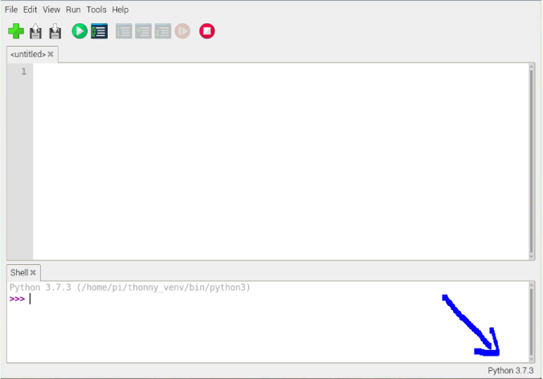
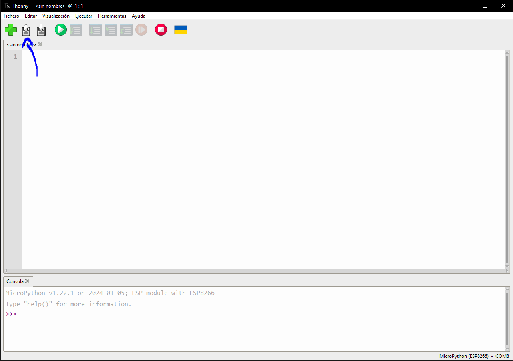
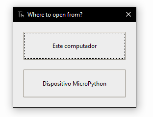
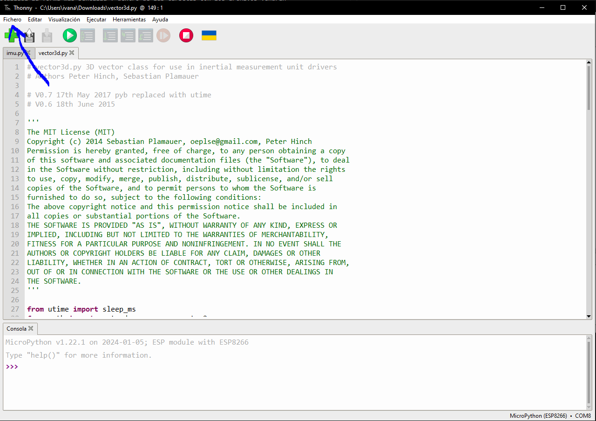
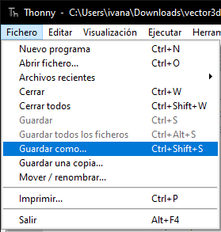
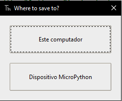
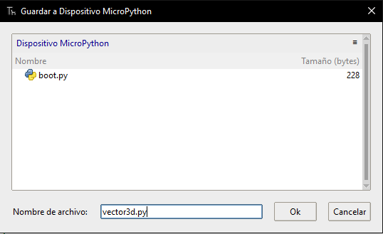
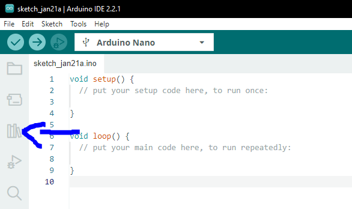
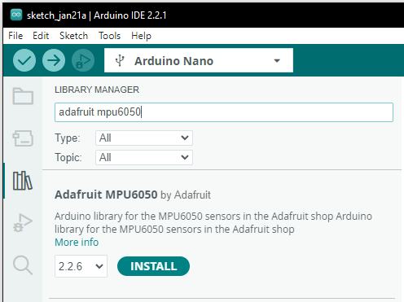

# Cansat Sistema de Comunicaciones

En este repositorio se encuentran todos los archivos necesarios, diagramas de conexión y codigos para hacer el sistema de comunicaciones del satelite enlatado.

## Dispositivos utilizados

 - Raspberry Pi Pico

 

 - Arduino Nano

 

 - Modulo de telemetria RYLR998

 

 - Sensor acelerometro y giroscopio MPU6050

 

## Conexiónes a los microcontroladores
### Conexiones con Raspberry Pi Pico
 

Como se muestra en el diagrama de conexiones y guiandonos de el pinout del raspberry pi pico, el modulo de telemetria (Lora RYLR998) va conectado de la siguiente forma

| Raspberry Pi Pico | Lora RYLR998 | 
| --------- | --------- |
| 3v3(Out) // Pin 36    | VDD // Pin 1   |
| GND // Pin 38    | GND // Pin 5    |
| UART0 RX // Pin 2    | TX // Pin 4   |
| UART0 TX // Pin 1    | RX // Pin 3    | 

De la misma manera tenemos las conexiones para conectar el acelerometro y giroscopio (MPU6050)

| Raspberry Pi Pico | MPU6050 | 
| --------- | --------- |
| 3v3(Out) // Pin 36    | VDD // Pin 1   |
| GND // Pin 38    | GND // Pin 2    |
| I2C1 SDA // Pin 4    | SDA // Pin 4   |
| I2C1 SCL // Pin 5    | SCL // Pin 3    |

### Conexiones a Arduino NANO
 

Para el caso de arduino tenemos las siguientes conexiones para el modulo de telemtria (Lora RYLR998)

| Arduino Nano | Lora RYLR998 | 
| --------- | --------- |
| +3v3 // Pin 17    | VDD // Pin 1   |
| GND // Pin 29    | GND // Pin 5    |
| UART0 RX // Pin 2    | TX // Pin 4   |
| UART0 TX // Pin 1    | RX // Pin 3    |

Y para las conexiones del celerometro y giroscopio (MPU6050)

| Arduino Nano | MPU6050 | 
| --------- | --------- |
| 5v // Pin 27    | VDD // Pin 1   |
| GND // Pin 29    | GND // Pin 2    |
| A4 SDA // Pin 23    | SDA // Pin 4   |
| A5 SCL // Pin 24    | SCL // Pin 3    |

## Requisitos Previos

### Trabajando con la Raspberry Pi Pico

Para trabajar con la raspberry se recomienda el uso de [Thonny](https://thonny.org) que es un IDE de programación muy amigable para todos aquellos que comienzan a programar en python, tiene una interfaz sencilla y te ayuda a realizar la configuración inicial de la raspberry, ademas sera el IDE que se utilizara de ejemplo.

[**Nota**] Los tutoriales de instalación de software se encontraran las distintas carpetas junto con los instaladores.

#### **Flasheo mediante Thonny**

Una vez que tengas instalado Thonny conecta tu raspberry pi pico mientras presionas el boton bootsel.


Al hacer esto tu computadora reconocera el dispositivo como una unidad de almacenamiento. Cuando abras thonny te aparecera una ventana similar a esa, da click donde dice *Python 3.X.X*

 

 y selecciona la opción que diga *Micropython (Raspberry Pi Pico)*

 

 Al hacer esto deberia aparecer una ventana en donde te permita instalar el firmware necesario para utilizar micropython en la raspberry. La ventana lucira algo asi

 

 Simplemente dale a instalar y espera a que termine la instalación, despues de eso cierra la ventana y ya estas listo para comenzar a programar 😊.

 #### **Flasheo Manual**


1. Descarga el firmware de micropython para raspberry pi pico dando click [aqui](https://micropython.org/download/rp2-pico/rp2-pico-latest.uf2)
2. Manten presionado el boton de BOOTSEL mientras conectas tu raspberry al dispositivo.
3. Te aparece tu raspberry como una unidad de almacenamiento. Normalmente llamado RPI-RP2
4. Arrastra el archivo UF2 que descargaste a tu raspberry.
5. Comienza a programar 😊.

#### **Descarga de librerias**

Para utilizar el modulo de telemetria no es necesario ninguna libreria, sin embargo para utilizar el acelerometro y giroscopio necesitaremos las siguientes librerias [imu.py](https://github.com/shillehbean/youtube-channel/blob/main/imu.py) y [vector3d.py](https://github.com/shillehbean/youtube-channel/blob/main/vector3d.py), para instalar las librerias existen varias formas, mediante la terminal(avanzado), haciendo uso de los beneficios que tiene thonny y utilizando el arrastrar y soltar los archivos dentro del microcontrolador(medio), finalmente guardando los archivos mediante el IDE(sencillo). Aqui explicare de manera detallada la forma mas sencilla y dentro de las carpetas con los archivos vendran los otros dos metodos explicados.

1. Da click a la opción de abrir fichero y selecciona este computador




2. Encuentra la libreria descargada y abrela
3. Da click en fichero, despues a guardar como




4. Aparecera una ventana preguntando a donde guardar, seleccionamos *Dispositivo MicroPython* 



5. Saldra una nueva ventana que nos pedira darle un nombre al archivo y nos mostrara los archivos que se encuentran en la memoria Flash de nuestro microcontrolador. En este caso estamos guardando la libreria vector3d.py por lo que lo guardaremos bajo ese nombre.



5. Y listo tenemos guardada nuestra libreria en la raspberry

### Trabajando con el Arduino Nano

Para trabajar con el arduino nano es necesario installar [arduino IDE](https://www.arduino.cc/en/software) que es un poderoso IDE que te agiliza el proceso de desarrollo al contar con una amplia compatibilidad de dispositivos y librerias listas para utilizarse.

#### **Instalación de librerias.**

Al utilizar el arduino nano con el modulo de telemetria no es necesario descargar ninguna libreria, sin embargo para utilizar el aceleroscopio y giroscopio es necesario instalar la libreria correspondiente, para ello hay que hacer lo siguiente.

1. Dar click a *Library Manager*



2. Buscar la libreria llamada *Adafruit MPU6050* y la instalamos. (Puede tardar un rato)



3. Listo tienes instalada la libreria y puedes comenzar a programar 😊.

## Programación.

Es importante señalar que se esta trabajando con dos distintos lenguajes de programación, mientras que arduino utiliza C++ en su mayoria, en la raspberry estariamos utilizando python para el desarrollo de la aplicación, es por eso que debemos tener mucho cuidado al seleccionar que hardware utilizaremos ya que no es compatible el codigo que se desarrolle en un hardware con el otro.

El modulo de telemetria hace uso del protocolo UART (universal asynchronous receiver transmitter) para comunicarse con el microcontrolador, pero solamente entiende instrucciones especificas que son una serie instruciones llamados comandos AT. Adjunto una tabla con los comandos mas importantes al igual que la liga para ver todos los comandos que hay [Comandos AT](https://reyax.com//upload/products_download/download_file/LoRa_AT_Command_RYLR998_RYLR498_EN.pdf)

| Syntax | Response | Explicación
| --------- | --------- | --------- | 
| AT    | +OK   | Comprueba que el modulo responda a los comandos. |
| AT+ADDRESS = < Address > **AT+ADDRESS=1**| +OK | Establece la dirección ID del modulo. | 
| AT+ADDRESS?    | +ADDRESS=1   | Responde la dirección ID del modulo |
| AT+SEND=< Dirección >,< Longitud del mensaje >,< Mensaje> **AT+SEND=0,4,Hola**   | +OK    | Envia un mensaje a un modulo con la dirección especificada |
| AT+SEND? | +SEND=0,4,Hola | Responde cual fue el ultimo mensaje transmitido. |
| +RCV=< Dirección>,< Longitud>,< Mensaje>,< RSSI>,< SNR> **+RCV=1,4,Hola,-99,40** | | Enseña la información recibida. |

**[¡Nota!]** Los mensajes enviados deben ser strings (cadenas de caracteres) o en su defecto formato ASCII.

**[¡Nota2!]** El modulo por default viene configurado a una velocidad de baudrate de 115200, por lo que al inicializar los modulos UART deberas especificar esa velocidad.


### Programando Raspberry Pi Pico

Como se explicaba arriba para comunicarse con el modulo de telemetria hay que hacer uso del protocolo UART para eso hay que usar las funciones que vienen con micropython

```python
from machine import UART, Pin # Importa el objeto UART
uart1 = UART(1, baudrate=9600, tx=Pin(4), rx=Pin(5)) # Inicializa el GPIO de UART 1 a una velocidad de 9600, le indica los pines 4 y 5 para TX y RX respectivamente (Estos pines varian segun el UART la pico tiene 8 pines 4 para UART0 y 4 para UART1)
uart1.write('hello')  # Escribe hello en el puerto
uart1.read(5)         # Lee 5 bytes e imprime lo leido
```
Esto es del lado del microcontrolador, ahora para poder hablar con el modulo tenemos que utilizar los comandos AT, un ejemplo sencillo seria

```python
from machine import UART, Pin # Importa el objeto UART
uart1 = UART(1, baudrate=115200, tx=Pin(4), rx=Pin(5)) # Inicializa el GPIO de UART 1 a una velocidad de 115200, le indica los pines 4 y 5 para TX y RX respectivamente 
uart1.write('AT\n\r')  # Checa si el modulo responde
uart1.read(5)         # Lee 5 bytes e imprime lo leido
```
En este ejemplo mandamos el comando AT que comprueba la conexión con el modulo por lo que estamos esperando que al leer el puerto recibamos 

```python
+OK
```

## Referencias
- Instructables. (2023, May 22). How to use MPU6050 with Raspberry Pi Pico or Pico W. Instructables. https://www.instructables.com/How-to-Use-MPU6050-With-Raspberry-Pi-Pico-or-Pico-/
- Instructables. (2023, July 6). How to connect MPU6050 to Arduino Nano Every. Instructables. https://www.instructables.com/How-to-Connect-MPU6050-to-Arduino-Nano-Every/
- Raspberry Pi documentation - MicroPython. (n.d.). https://www.raspberrypi.com/documentation/microcontrollers/micropython.html#drag-and-drop-micropython
- Add the MicroPython firmware | Getting started with Raspberry Pi Pico | Micropython | Coding projects for kids and teens. (n.d.). https://projects.raspberrypi.org/en/projects/getting-started-with-the-pico/3
- Quick reference for the RP2 — MicroPython latest documentation. (n.d.). https://docs.micropython.org/en/latest/rp2/quickref.html
